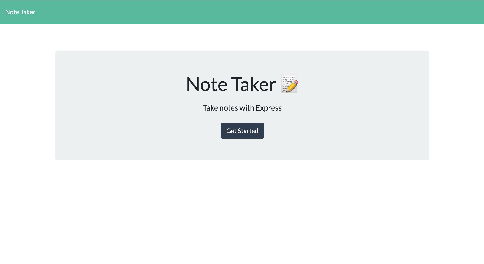
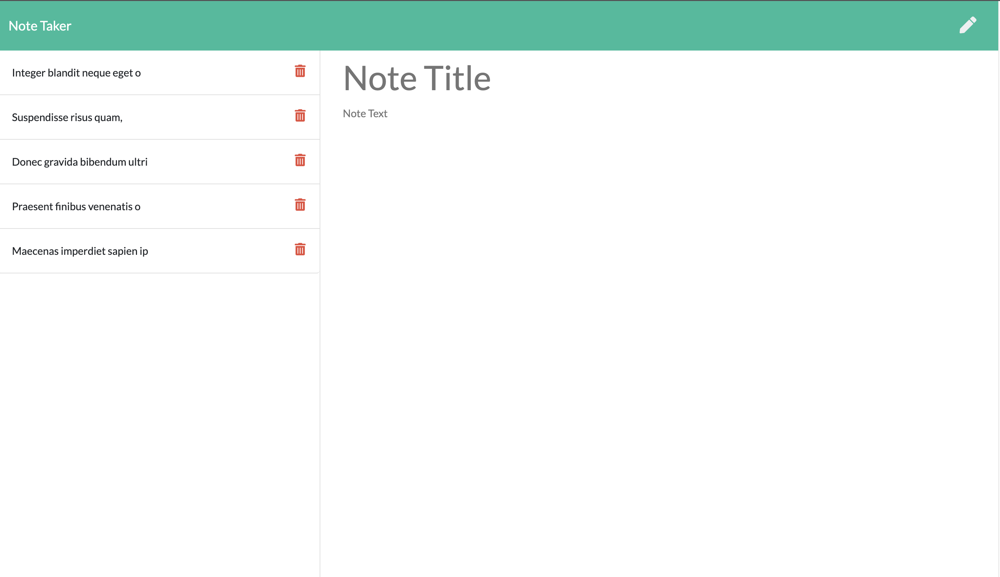
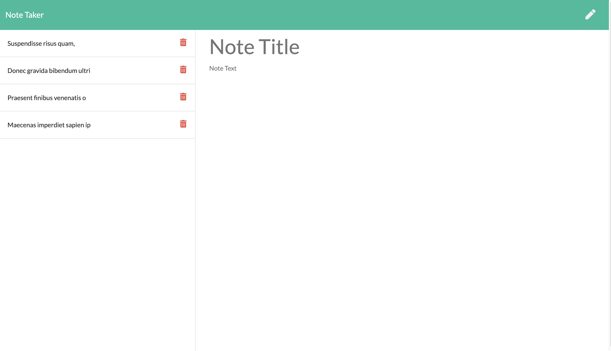

# Express Note Taker

  
  
  
  
  
  
  

---

## Table of Contents
  * [Description](#description)
  * [Visuals](#visuals)
  * [License](#license)
  * [Contributing](#contribution)
  * [Questions](#contact-information)

---

## Description
An application that can be used to write, save, and delete notes using Node and Express, utilizing JSON for data storage. With an already completed front-end, my role was to build the back-end and connect it to the front-end.
## Visuals

---

---

---

## License
  
  * For more information on license types, please reference this website
  for additional licensing information - [https: //choosealicense.com/](https://choosealicense.com/).

---

  ## Contributing

Not accepting contributions at this time.

---

## Contact Information
  * GitHub Username: [mffonua](https://github.com/mffonua)
  * Email: myles.fonua@gmail.com.com
  * 

    
    
