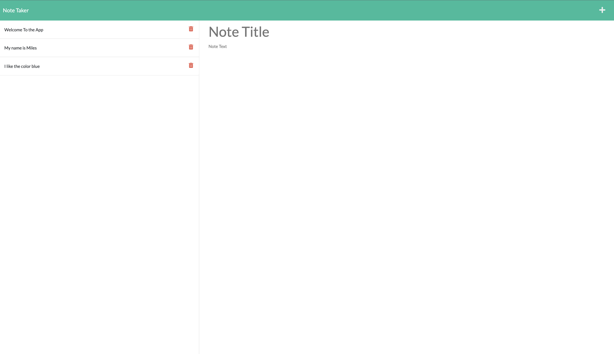
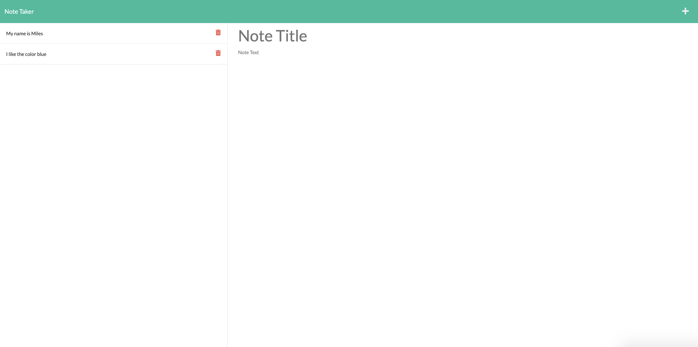
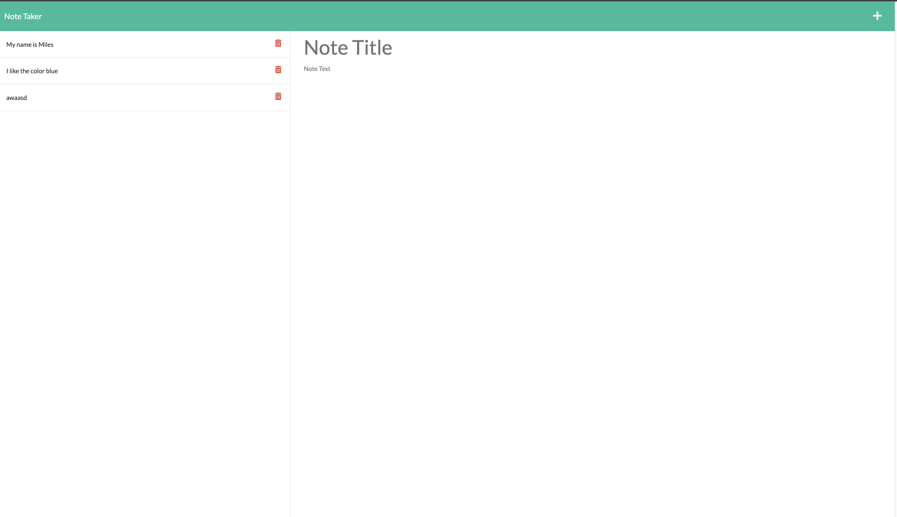

# Express Note Taker

  
  
  
  
  
  
  

---

## Table of Contents
  * [Description](#description)
  * [Visuals](#visuals)
  * [License](#license)
  * [Contributing](#contribution)
  * [Questions](#contact-information)

---

## Description
This application can be used to write, save and delete notes. This application uses an Express.js back end and will save and retrieve note data from a JSON file.

## Visuals
View the live application here:

Main Page

---
Once Inside Note Taker

--- 
Deleted Notes

--- 
Added Notes

---

## License
  
  * For more information on license types, please reference this website
  for additional licensing information - [https: //choosealicense.com/](https://choosealicense.com/).

---

  ## Contributing

Not accepting contributions at this time.

---

## Contact Information
  * GitHub Username: [mffonua](https://github.com/mffonua)
  * Email: myles.fonua@gmail.com.com
  * 

    
    
